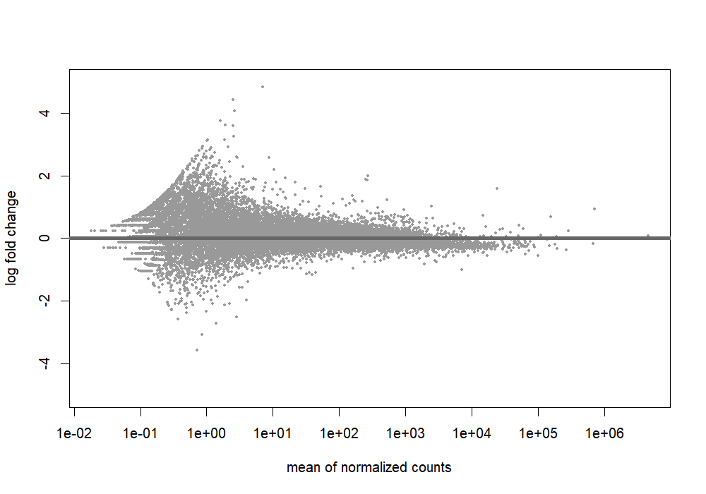
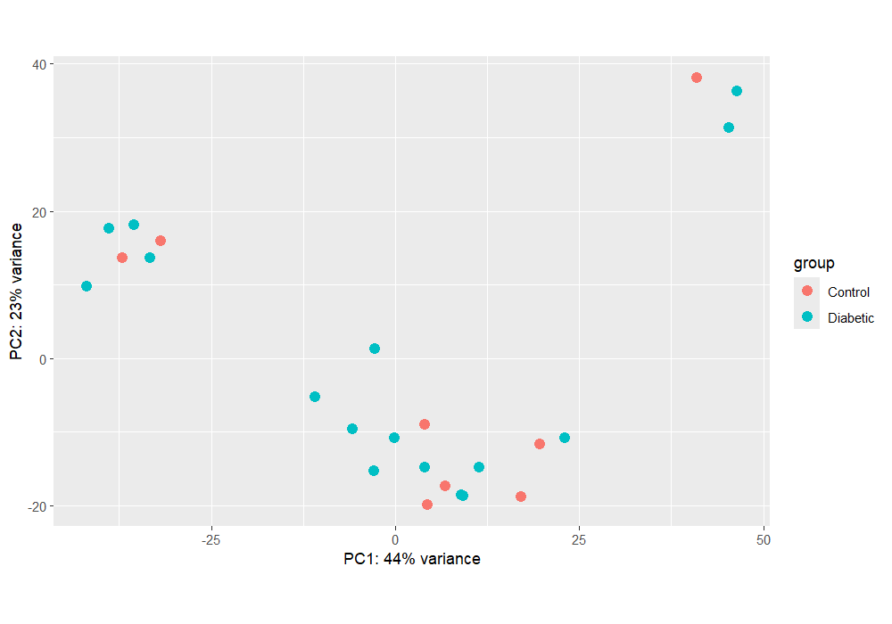
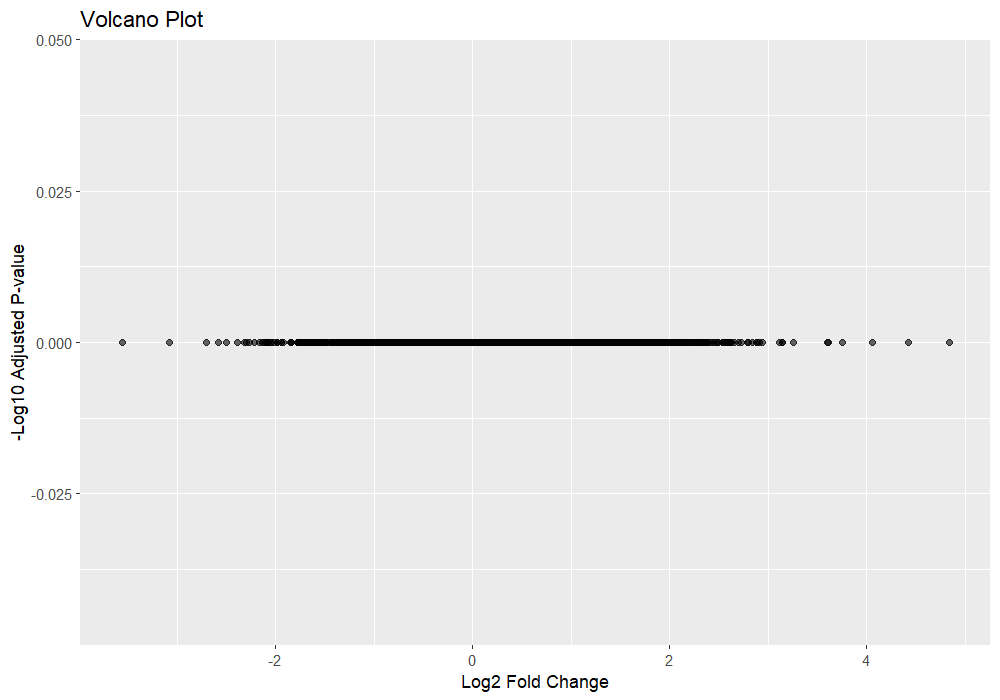
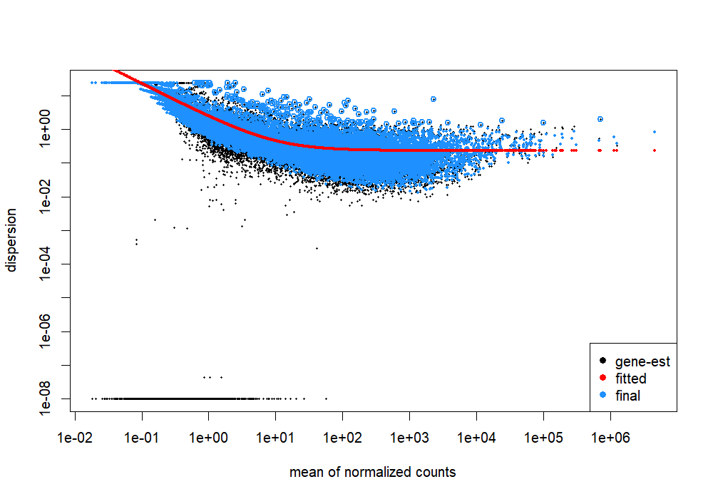
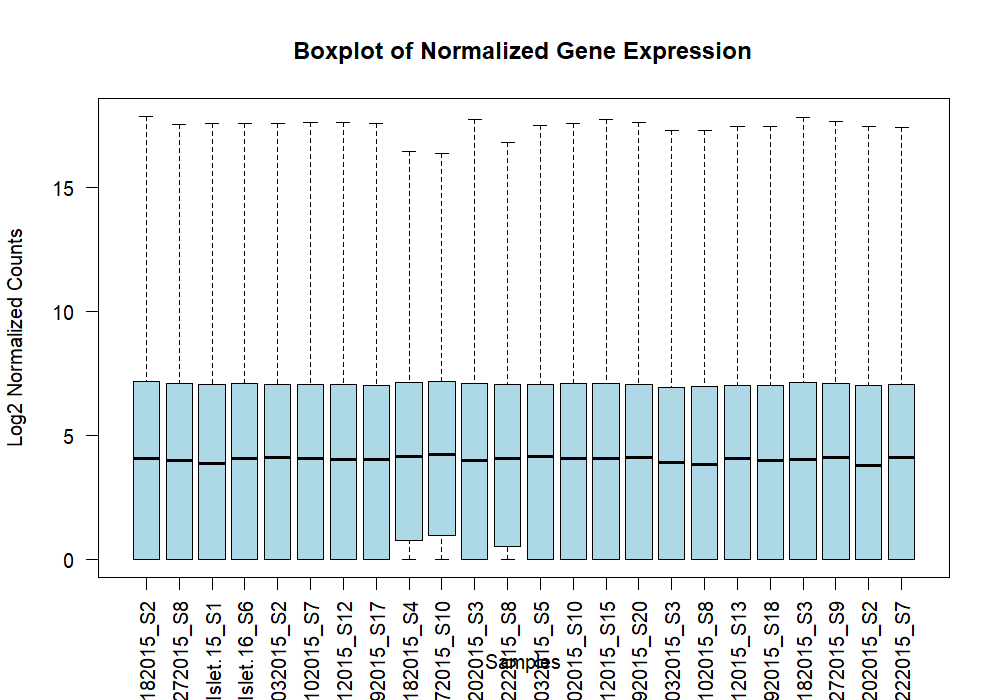

# RNA-Seq Differential Expression Analysis Using DESeq2

A reproducible RNA-seq differential gene expression analysis pipeline built in **R** using the **DESeq2** Bioconductor package. This project analyzes publicly available pancreatic islet RNA-seq data from individuals with **Type 2 Diabetes (T2D)** and healthy controls to identify differentially expressed genes.

---

## Project Overview

This project demonstrates a complete RNA-seq differential expression workflow using DESeq2, including:

- Importing RNA-seq count data
- Preparing sample metadata
- Creating a DESeq2 dataset
- Normalizing RNA-seq counts
- Performing differential expression analysis
- Visualizing results
- Exporting results for downstream analysis

The project was developed as part of my bioinformatics portfolio to strengthen practical skills in RNA-seq data analysis using R and Bioconductor.

---

## Research Question

**Which genes are differentially expressed between pancreatic islet samples from individuals with Type 2 Diabetes and healthy controls?**

---

## Dataset

**Source:** Gene Expression Omnibus (GEO)

**Accession:** GSE86468

**Organism:** *Homo sapiens*

**Tissue:** Pancreatic Islets

**Samples**

- 16 Type 2 Diabetes samples
- 8 Healthy control samples

The dataset contains **RSEM expected counts**, which were rounded to integer values for educational demonstration because DESeq2 requires integer count data. In production analyses, raw count data (for example, generated by featureCounts) would typically be used.

---

# Workflow

```
RNA-seq Count Data
        │
        ▼
Load Dataset
        │
        ▼
Create Sample Metadata
        │
        ▼
Prepare Count Matrix
        │
        ▼
Create DESeq2 Dataset
        │
        ▼
Normalization
        │
        ▼
Differential Expression Analysis
        │
        ▼
Visualization
        │
        ▼
Export Results
```

---

# Repository Structure

```
RNASeq-Differential-Expression-DESeq2/
│
├── data/
│   └── GSE86468_GEO.bulk.islet.processed.data.RSEM.raw.expected.counts.csv.gz
│
├── figures/
│   ├── MA_plot.png
│   ├── PCA_plot.png
│   ├── Volcano_plot.png
│   ├── Dispersion_plot.png
│   └── Boxplot_Normalized_Counts.png
│
├── notebooks/
│   ├── Differential_Expression_DESeq2.Rmd
│   └── Differential_Expression_DESeq2.html
│
├── results/
│   └── DESeq2_results.csv
│
└── README.md
```

---

# Visualizations

## MA Plot

Shows log2 fold change versus average normalized gene expression.



---

## Principal Component Analysis (PCA)

Summarizes overall variation among samples after variance stabilizing transformation.



---

## Volcano Plot

Displays both the magnitude of gene expression changes (log2 fold change) and statistical significance (adjusted p-value).



---

## Dispersion Plot

Illustrates the estimated biological variability modeled by DESeq2.



---

## Boxplot of Normalized Counts

Demonstrates successful normalization across RNA-seq samples.



---

# Results

- Analyzed **24,875 genes** with non-zero counts.
- No genes satisfied the selected adjusted p-value threshold after Benjamini–Hochberg false discovery rate correction.
- The MA plot, PCA plot, Volcano plot, and dispersion estimates were consistent with the statistical results.
- The normalized count distributions were comparable across samples, indicating successful normalization.

Although no statistically significant genes were identified, the project demonstrates a complete and reproducible DESeq2 workflow commonly used in RNA-seq differential expression studies.

---

# Software & Packages

- R
- RStudio
- DESeq2
- Bioconductor
- ggplot2
- R Markdown

---

# Skills Demonstrated

- RNA-seq analysis
- Differential gene expression analysis
- DESeq2
- Bioconductor
- R programming
- R Markdown
- Data preprocessing
- Statistical hypothesis testing
- False Discovery Rate (FDR) correction
- Principal Component Analysis (PCA)
- Data visualization
- Bioinformatics workflow development
- Reproducible research
- Git & GitHub

---

# Future Improvements

- Functional enrichment analysis (GO/KEGG)
- Gene annotation
- Pathway analysis
- Interactive visualizations
- Automated RNA-seq pipeline using Nextflow

---

# Author

**Shradha Upadhyay**

M.S. Bioinformatics & Computational Biology

The University of Texas at Dallas


